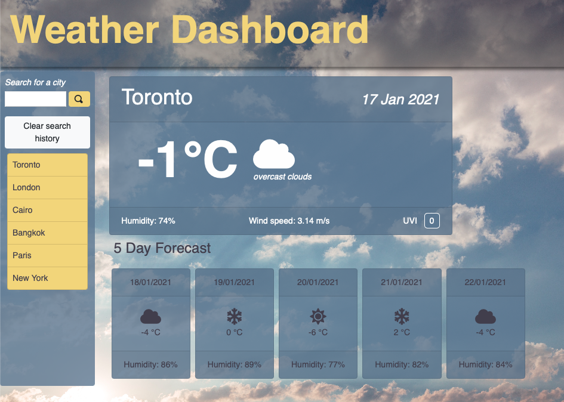

# Weather Dashboard
A simple weather app. Users can search the name of a city, and current weather data including temperature, humidity, UV Index, and wind speed will be displayed. An icon indicates general weather conditions. The colour of the UV Index indicates severity.

Along with current weather data, a 5-day forecast is displayed containing temperature, humdidity and a description of weather conditions.

Previously searched for cities are displyed in the search history, and weather data for those cities can be searched for again by clicking on the city name in the search history.

The layout was created with Bootstrap, with additional styling via custom CSS. JQuery ws used in combintion with javaScript. Date and time were managed with Moment.js.

The page can be found [here](https://amelia-was.github.io/weather-dashboard/)

## Built Using
- HTML
- CSS
- JavaScript
- jQuery
- Bootstrap
- Moment.js
